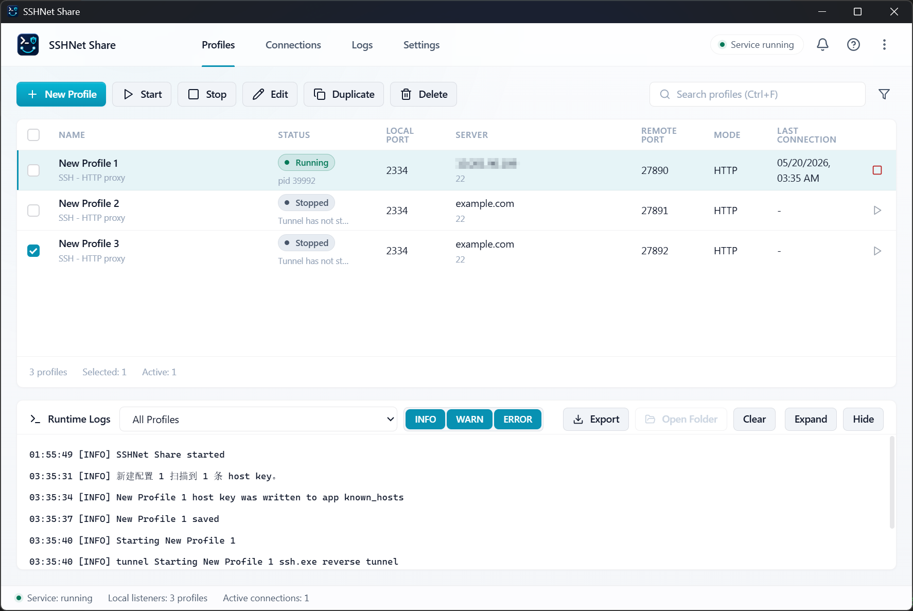
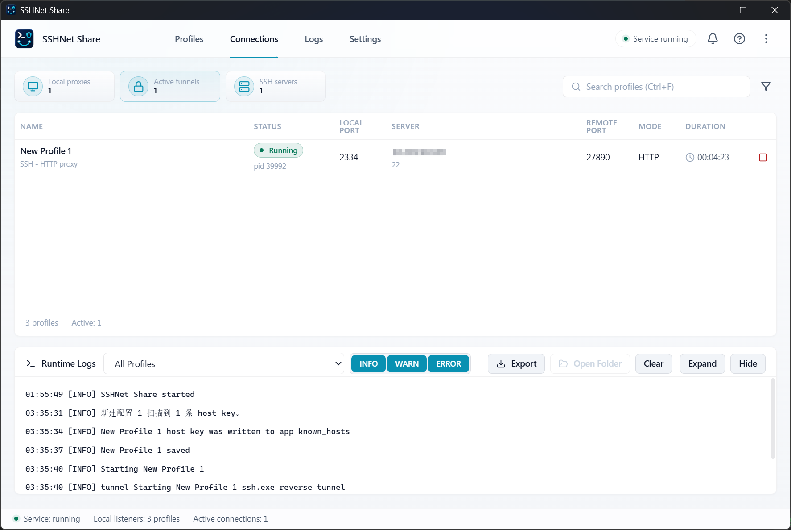
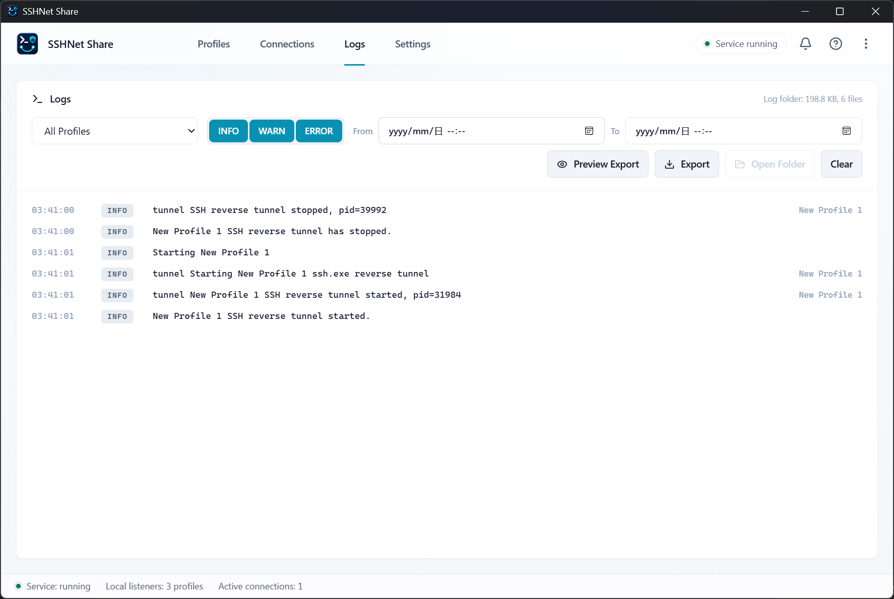
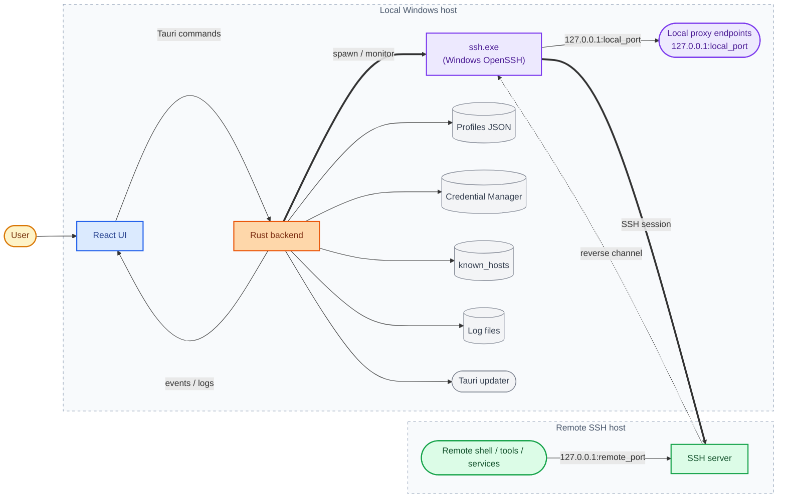
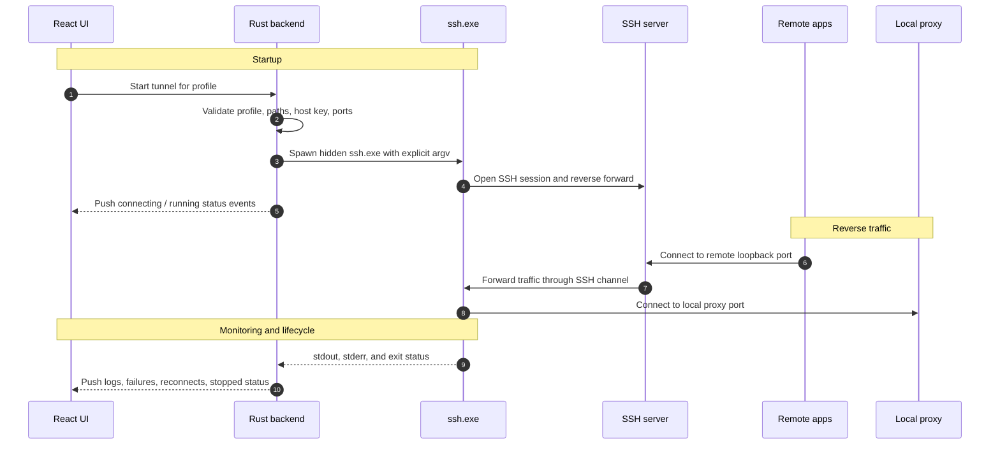

<div align="center">

# SSHNet Share

**A Windows desktop client that brings local proxy endpoints to remote SSH servers via managed reverse tunnels.**

[](LICENSE)
[](#platform-support)
[](https://github.com/superheroYu/sshnet-share/releases/latest)
[](https://tauri.app)
[](https://react.dev)
[](https://www.rust-lang.org)

**English** · [简体中文](README.zh-CN.md)

</div>

---

SSHNet Share is a Windows desktop client that brings one or more local proxy endpoints to remote SSH server environments through managed reverse tunnels, so server-side shells, developer tools, and services can use selected local network egress paths without deploying proxy services on the server.

<table>
  <tr>
    <td width="170"><b>Latest release</b></td>
    <td><code>v0.1.1</code></td>
  </tr>
  <tr>
    <td><b>Repository</b></td>
    <td><a href="https://github.com/superheroYu/sshnet-share">github.com/superheroYu/sshnet-share</a></td>
  </tr>
  <tr>
    <td><b>License</b></td>
    <td>Source-available under <a href="LICENSE">PolyForm Noncommercial License 1.0.0</a>. Noncommercial use is allowed; commercial use requires separate authorization from superheroYu &mdash; <a href="https://github.com/superheroYu/sshnet-share/issues">open an issue</a> to discuss.</td>
  </tr>
</table>

---

## Screenshots

### Profiles



### Runtime Views

| Active Connections | Logs |
|:---:|:---:|
|  |  |

## Platform Support

SSHNet Share `v0.1.1` is **Windows-only**. The current packaging, updater workflow, credential storage, and OpenSSH behavior checks target Windows desktop environments.

## Tech Stack

| Layer | Components |
|:---|:---|
| **Desktop shell** | Tauri 2 &mdash; Rust backend with a WebView frontend |
| **Frontend** | React 19 · TypeScript · Vite · lucide-react |
| **Backend** | Rust 2021 · serde / serde_json · zeroize · windows-sys · zip |
| **Windows integration** | OpenSSH Client · Credential Manager · tray · autostart · notifications · file dialogs · single-instance · updater hooks |
| **Packaging** | Tauri NSIS installer · signed updater artifacts · GitHub Releases |
| **Verification** | Rust unit tests · Playwright E2E · TypeScript build · clippy |

## Architecture Overview

- **React UI** owns the desktop experience: profile management, active connections, logs, settings, notifications, diagnostics, and release-facing copy.
- **Rust backend** owns privileged and system-facing work: profile validation and storage, credential references, OpenSSH argument construction, host key trust, tunnel lifecycle, process cleanup, logging, diagnostics, and updater checks.
- **Profiles** each own one local proxy endpoint and one remote loopback port. Running multiple profiles provides multi-port and multi-proxy routing across different local proxies, remote ports, or SSH servers.
- **Tunnels** are managed Windows OpenSSH child processes using explicit argv, app-owned `known_hosts`, hidden console windows, and reverse forwarding equivalent to `ssh.exe -N -T -R <remote>:<local>`.
- **IPC** flows through Tauri commands and events. Status changes and log entries are pushed to the UI so long-running tunnels can be monitored without shell access.
- **User data** stays local by default. Profiles, logs, known hosts, startup preferences, and diagnostic ZIPs are stored under the app data / log directories; diagnostics are exported manually and redacted before sharing.

## Architecture Diagrams

### High-level component map



### Tunnel startup and runtime flow



## Features

**Tunnel management**
- Multi-profile, multi-port SSH reverse tunnel management.
- Separate profiles for different local proxies, remote ports, SSH users, or SSH servers.
- Auto reconnect with manual stop cancellation.
- Active Connections view with per-tunnel details.

**Authentication and host trust**
- Key, Windows OpenSSH `ssh-agent`, and password authentication.
- Optional SSH password storage in Windows Credential Manager.
- Host Key scan, trust, and replacement confirmation using an app-owned `known_hosts`.

**Observability**
- Productized Logs page with profile filter, level filter, date range, preview, redacted export, and log storage size.
- Lightweight runtime log dock on profile and connection pages.
- Notification center event history.
- Local diagnostic ZIP export for manual issue reports.

**Desktop experience**
- Light and dark themes with system color mode support.
- Optional start on boot, with a silent startup mode for tray-first workflows.

**Distribution**
- Windows NSIS installer and Tauri updater wiring.

## Installation

The first public test build will be distributed through GitHub Releases as a Windows NSIS installer.

> [!WARNING]
> Early builds are not Windows code-signed. Windows may show **Unknown Publisher** or **SmartScreen** prompts. Only install builds downloaded from the project release page or another maintainer-confirmed channel.

Automatic update support is wired through Tauri updater and checks:

```text
https://github.com/superheroYu/sshnet-share/releases/latest/download/latest.json
```

## Feedback And Diagnostics

> [!NOTE]
> SSHNet Share does not automatically upload telemetry, analytics, crash reports, logs, or diagnostic data.

When reporting an issue, use the Help panel to export a diagnostic ZIP. The ZIP is saved locally under the app log directory and must be submitted manually by the user. It contains environment metadata, profile summaries, log storage information, and privacy-safe diagnostic logs. It does **not** include real host names, user names, profile names, private key paths, passwords, tokens, or raw log message bodies.

Report bugs and feedback at <https://github.com/superheroYu/sshnet-share/issues>.

> [!IMPORTANT]
> Do not paste private keys, passwords, raw diagnostic bundles, or unredacted host / user information into public issues.

## Development

**Prerequisites**

- Node.js and npm
- Rust stable MSVC toolchain
- Microsoft C++ Build Tools
- Microsoft Edge WebView2 Runtime
- Windows OpenSSH Client

**Install dependencies and run the desktop app**

```powershell
npm install
npm run tauri dev
```

**Run verification**

```powershell
npm run build
npm run test:e2e
& $env:USERPROFILE\.cargo\bin\cargo.exe test --locked
& $env:USERPROFILE\.cargo\bin\cargo.exe clippy --all-targets --locked -- -D warnings
git diff --check
```

**Build a Windows package locally**

See [`docs/package-build.md`](docs/package-build.md) for the two supported build modes: release-like updater artifacts with a signing key, or an install-only local smoke build with updater artifacts disabled by a temporary config override.

## Documentation

| Document | Purpose |
|:---|:---|
| [`README.zh-CN.md`](README.zh-CN.md) | Simplified Chinese README |
| [`LICENSE`](LICENSE) | PolyForm Noncommercial License 1.0.0 and required notices |
| [`CHANGELOG.md`](CHANGELOG.md) | Release history |
| [`SECURITY.md`](SECURITY.md) | Vulnerability reporting and diagnostic privacy policy |
| [`docs/file-navigation.md`](docs/file-navigation.md) | Where to start for each feature area |
| [`docs/release.md`](docs/release.md) | Release and updater checklist |
| [`docs/dev-start.md`](docs/dev-start.md) | Run the app from source without installing |
| [`docs/package-build.md`](docs/package-build.md) | Local Windows installer build tutorial |
| [`docs/smoke-test.md`](docs/smoke-test.md) | Finite pre-release smoke test |

---

<div align="center">
<sub>Source-available under <a href="LICENSE">PolyForm Noncommercial License 1.0.0</a></sub>
</div>
