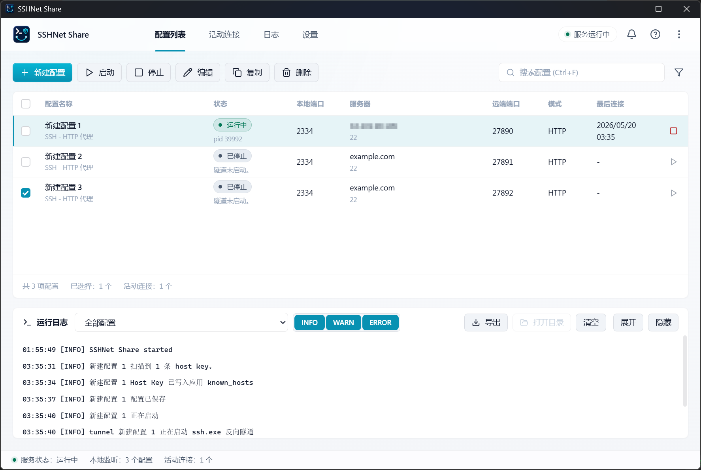
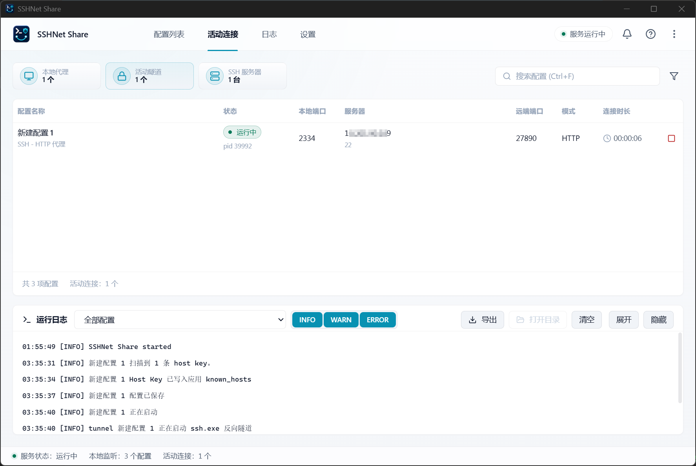
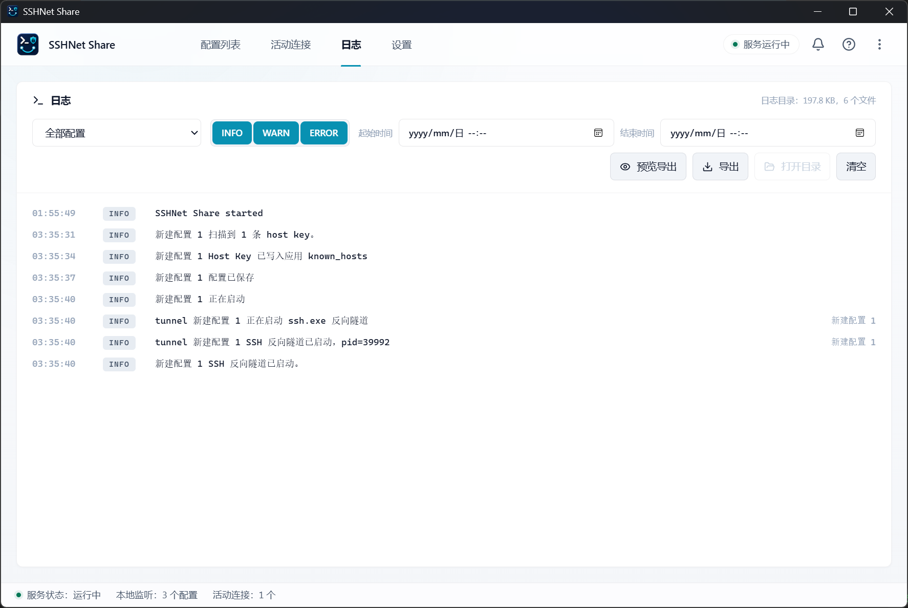
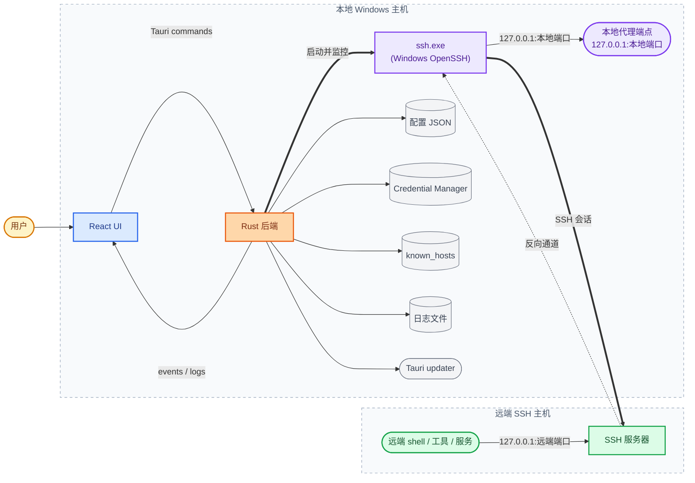
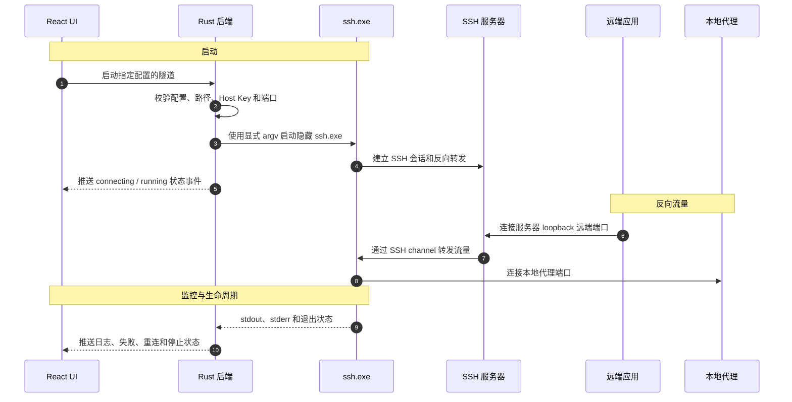

<div align="center">

# SSHNet Share

**用受管理的 SSH 反向隧道，把本机代理端点带到远端 SSH 服务器的 Windows 桌面客户端。**

[](LICENSE)
[](#平台支持)
[](https://github.com/superheroYu/sshnet-share/releases/latest)
[](https://tauri.app)
[](https://react.dev)
[](https://www.rust-lang.org)

[English](README.md) · **简体中文**

</div>

---

SSHNet Share 是一个 Windows 桌面客户端，用受管理的 SSH 反向隧道把一个或多个本机代理端点带到远端服务器环境，让服务器上的命令行、开发工具和服务进程可以按需使用不同的本机网络出口，而不需要在服务器上部署代理服务。

<table>
  <tr>
    <td width="170"><b>当前发布版本</b></td>
    <td><code>v0.1.1</code></td>
  </tr>
  <tr>
    <td><b>仓库地址</b></td>
    <td><a href="https://github.com/superheroYu/sshnet-share">github.com/superheroYu/sshnet-share</a></td>
  </tr>
  <tr>
    <td><b>许可证</b></td>
    <td>采用 <a href="LICENSE">PolyForm Noncommercial License 1.0.0</a> 以 source-available 方式公开源码，允许非商业使用；商业使用需要获得 superheroYu 的单独授权 &mdash; 请通过 <a href="https://github.com/superheroYu/sshnet-share/issues">issue</a> 联系。</td>
  </tr>
</table>

---

## 界面截图

### 配置列表



### 运行视图

| 活动连接 | 日志 |
|:---:|:---:|
|  |  |

## 平台支持

SSHNet Share `v0.1.1` **仅支持 Windows**。当前的安装包、更新器流程、凭据存储和 OpenSSH 行为检查都面向 Windows 桌面环境。

## 技术栈

| 层 | 组件 |
|:---|:---|
| **桌面外壳** | Tauri 2 &mdash; Rust 后端 + WebView 前端 |
| **前端** | React 19 · TypeScript · Vite · lucide-react |
| **后端** | Rust 2021 · serde / serde_json · zeroize · windows-sys · zip |
| **Windows 集成** | OpenSSH Client · Credential Manager · 系统托盘 · 开机自启动 · 通知 · 文件对话框 · 单实例 · 更新器 |
| **打包发布** | Tauri NSIS 安装包 · 签名 updater 产物 · GitHub Releases |
| **验证方式** | Rust 单元测试 · Playwright E2E · TypeScript build · clippy |

## 架构概览

- **React UI** 负责桌面体验：配置管理、活动连接、日志、设置、通知、诊断和面向发布的文案。
- **Rust 后端** 负责系统相关能力：配置校验与存储、凭据引用、OpenSSH 参数构造、Host Key 信任、隧道生命周期、进程清理、日志、诊断和更新检查。
- **每个配置** 负责一个本机代理端点和一个远端 loopback 端口。运行多个配置即可实现多端口、多代理端点的路由，覆盖不同本地代理、远端端口或 SSH 服务器。
- **每条隧道** 由受管理的 Windows OpenSSH 子进程承载，使用显式 argv、应用专属 `known_hosts`、隐藏控制台窗口，以及等价于 `ssh.exe -N -T -R <remote>:<local>` 的反向转发。
- **前后端** 通过 Tauri commands 和 events 通信。状态变化和日志会推送到 UI，让长期运行的隧道无需打开 shell 也能被观察。
- **用户数据** 默认保留在本地。配置、日志、known hosts、启动偏好和诊断 ZIP 存放在应用数据 / 日志目录下；诊断数据需要用户手动导出，并在分享前进行脱敏。

## 技术架构图

### 整体组件关系



### 隧道启动和运行流程



## 功能

**隧道管理**
- 多配置、多端口 SSH 反向隧道管理。
- 可为不同本地代理、远端端口、SSH 用户或 SSH 服务器建立独立配置。
- 自动重连，并支持手动停止后取消重连。
- 活动连接页面，展示每条隧道的运行详情。

**认证与主机信任**
- 支持密钥、Windows OpenSSH `ssh-agent` 和密码认证。
- 可选将 SSH 密码保存到 Windows Credential Manager。
- 使用应用专属 `known_hosts` 进行 Host Key 扫描、信任和变更确认。

**可观测性**
- 完整日志页面，支持配置筛选、等级筛选、日期范围、预览、脱敏导出和日志存储大小查看。
- 配置页和连接页内置轻量运行日志条。
- 通知中心保留事件历史。
- 本地诊断 ZIP 导出，便于手动提交问题。

**桌面体验**
- 支持浅色 / 深色主题，并可跟随系统颜色模式。
- 支持可选开机自启动，并提供适合托盘常驻的开机静默启动模式。

**分发**
- Windows NSIS 安装包和 Tauri updater 流程。

## 安装

首个公开测试版本会通过 GitHub Releases 分发 Windows NSIS 安装包。

> [!WARNING]
> 早期版本不会进行 Windows 代码签名。Windows 可能显示 **Unknown Publisher** 或 **SmartScreen** 提示。请只安装从项目 Release 页面或维护者确认渠道下载的版本。

自动更新已接入 Tauri updater，更新检查地址为：

```text
https://github.com/superheroYu/sshnet-share/releases/latest/download/latest.json
```

## 反馈和诊断

> [!NOTE]
> SSHNet Share 不会自动上传遥测、分析数据、崩溃报告、日志或诊断数据。

提交问题时，可以在帮助面板中导出诊断 ZIP。ZIP 会保存在本地应用日志目录下，需要用户手动提交。它包含环境信息、配置摘要、日志存储信息和隐私安全的诊断日志；**不**包含真实主机名、用户名、配置名、私钥路径、密码、令牌或原始日志正文。

Bug 和反馈请提交到 <https://github.com/superheroYu/sshnet-share/issues>。

> [!IMPORTANT]
> 请不要在公开 issue 中粘贴私钥、密码、原始诊断包，或未脱敏的主机 / 用户信息。

## 开发

**前置要求**

- Node.js 和 npm
- Rust stable MSVC toolchain
- Microsoft C++ Build Tools
- Microsoft Edge WebView2 Runtime
- Windows OpenSSH Client

**安装依赖并启动桌面应用**

```powershell
npm install
npm run tauri dev
```

**运行验证**

```powershell
npm run build
npm run test:e2e
& $env:USERPROFILE\.cargo\bin\cargo.exe test --locked
& $env:USERPROFILE\.cargo\bin\cargo.exe clippy --all-targets --locked -- -D warnings
git diff --check
```

**本地构建 Windows 安装包**

请参考 [`docs/package-build.md`](docs/package-build.md)。文档中区分了两种构建方式：带签名 key 的 release-like updater 产物构建，以及通过临时配置关闭 updater artifacts 的本地安装 smoke build。

## 文档

| 文档 | 用途 |
|:---|:---|
| [`README.md`](README.md) | 英文 README |
| [`LICENSE`](LICENSE) | PolyForm Noncommercial License 1.0.0 和必要声明 |
| [`CHANGELOG.md`](CHANGELOG.md) | 发布记录 |
| [`SECURITY.md`](SECURITY.md) | 漏洞报告和诊断隐私政策 |
| [`docs/file-navigation.md`](docs/file-navigation.md) | 按功能定位代码入口 |
| [`docs/release.md`](docs/release.md) | 发布和更新器检查清单 |
| [`docs/dev-start.md`](docs/dev-start.md) | 不安装应用，直接从源码启动 |
| [`docs/package-build.md`](docs/package-build.md) | 本地 Windows 安装包构建教程 |
| [`docs/smoke-test.md`](docs/smoke-test.md) | 发布前有限 smoke test |

---

<div align="center">
<sub>以 <a href="LICENSE">PolyForm Noncommercial License 1.0.0</a> 公开源码</sub>
</div>
